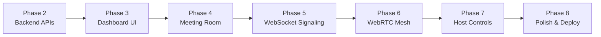

# Zoom Clone — Full Implementation Plan

## Current State (Phase 1 Complete)

- Monorepo scaffold: Turborepo + pnpm, Next.js 16 + FastAPI
- Design system UI components (`ZoomButton`, `ZoomCard`, `ZoomSkeleton`)
- DB models + Pydantic schemas defined but wired to zero routes
- WebSocket relay stub (broadcasts JSON, no event logic)
- `app/page.tsx` is a design showcase, not a real dashboard
- No hooks, no `lib/api.ts`, no frontend pages

## Phases Overview

Each phase has its own detailed plan file in `docs/plan/`. This document is the index.

## Phase Files

- [`docs/plan/PHASE_2_backend_apis.md`](docs/plan/PHASE_2_backend_apis.md)
- [`docs/plan/PHASE_3_dashboard_ui.md`](docs/plan/PHASE_3_dashboard_ui.md)
- [`docs/plan/PHASE_4_meeting_room.md`](docs/plan/PHASE_4_meeting_room.md)
- [`docs/plan/PHASE_5_websocket_signaling.md`](docs/plan/PHASE_5_websocket_signaling.md)
- [`docs/plan/PHASE_6_webrtc_mesh.md`](docs/plan/PHASE_6_webrtc_mesh.md)
- [`docs/plan/PHASE_7_host_controls.md`](docs/plan/PHASE_7_host_controls.md)
- [`docs/plan/PHASE_8_polish.md`](docs/plan/PHASE_8_polish.md)

## Quick-reference: files touched per phase

| Phase | Backend files                                                                                                  | Frontend files                                                                                                   |
| ----- | -------------------------------------------------------------------------------------------------------------- | ---------------------------------------------------------------------------------------------------------------- |
| 2     | `schemas.py`, `services/meeting_service.py` (new), `routers/meetings.py`, `routers/participants.py`, `seed.py` | —                                                                                                                |
| 3     | —                                                                                                              | `lib/types.ts`, `lib/api.ts`, `lib/constants.ts`, `app/page.tsx`, `app/dashboard/`, `app/join/`, `app/schedule/` |
| 4     | —                                                                                                              | `app/meeting/[meetingCode]/`, `components/meeting/`, `hooks/useMediaDevices.ts`                                  |
| 5     | `websocket/manager.py`, `websocket/signaling.py`                                                               | `hooks/useWebSocket.ts`, wire room page                                                                          |
| 6     | —                                                                                                              | `hooks/useWebRTC.ts`, video grid with remote streams                                                             |
| 7     | signaling.py host auth                                                                                         | host UI, end-meeting flow                                                                                        |
| 8     | `seed.py` (richer data)                                                                                        | layout.tsx metadata, error states, README                                                                        |
