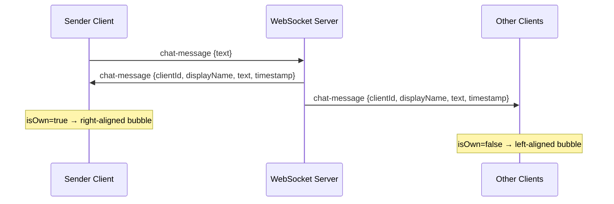
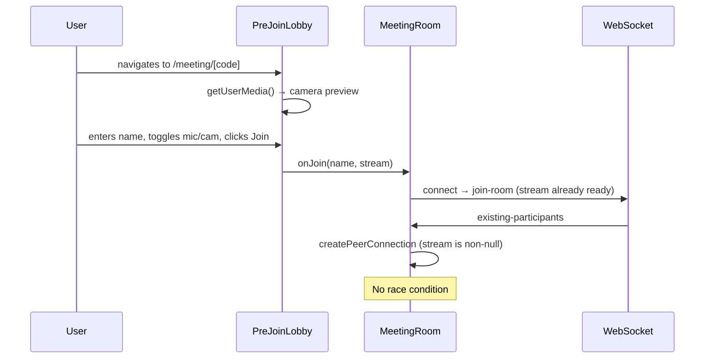
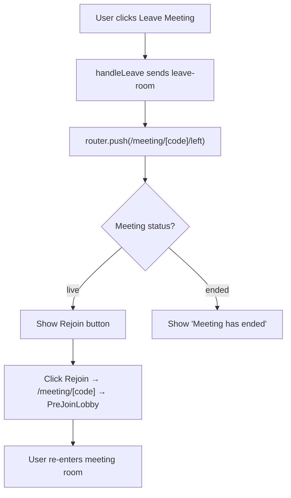

# Phase 10 — New Features: Chat, Pre-Join Lobby, and Rejoin

## Overview

Three user-facing features to be added after all Phase 9 bugs are resolved. Each feature is self-contained and can be implemented independently in the order listed below (recommended: pre-join first, as it also resolves the Bug 1 race condition structurally).

---

## Feature 1 — In-Meeting Chat

### Goal

Allow participants to send and receive text messages during a meeting without leaving the video view.

### Scope

Chat messages are ephemeral — they exist in-memory only for the duration of the session and are not persisted to the database. This is the correct trade-off for MVP: the WebSocket room already handles the broadcast, and adding a chat table would require schema migrations and a separate API endpoint.

### Backend changes

**File:** `apps/api/websocket/signaling.py`

Add a `chat-message` event handler. When received, broadcast the message to all participants in the room (including the sender, so they see their own message in the shared feed):

```python
case "chat-message":
    text: str = str(data.get("text", "")).strip()
    if not text:
        continue
    from datetime import datetime, timezone
    await manager.broadcast(
        meeting_code,
        {
            "event": "chat-message",
            "clientId": client_id,
            "displayName": manager.rooms[meeting_code][client_id][1].display_name,
            "text": text,
            "timestamp": datetime.now(timezone.utc).isoformat(),
        },
    )
```

### Frontend changes

**`apps/web/lib/types.ts`** — Add new types:

```typescript
export interface ChatMessage {
  id: string;               // crypto.randomUUID() assigned on receipt
  clientId: string;
  displayName: string;
  text: string;
  timestamp: string;        // ISO 8601
  isOwn: boolean;           // true when clientId matches local clientId
}

// Add to WSMessage union:
| { event: "chat-message"; text: string }

// Add to WSEvent union:
| {
    event: "chat-message";
    clientId: string;
    displayName: string;
    text: string;
    timestamp: string;
  }
```

**`apps/web/components/meeting/ChatSidebar.tsx`** — New component, mirrors the layout of `ParticipantsSidebar`:

- Header: "Chat" label + unread count badge + close button.
- Message list: scrollable, auto-scrolls to newest message on arrival.
- Message bubbles: own messages right-aligned with a distinct background; others left-aligned with avatar initial.
- Input row: text input + send button (also sends on Enter key).
- Empty state: "No messages yet. Say hello."

**`apps/web/app/meeting/[meetingCode]/MeetingRoom.tsx`** — Wire chat:

- Add `messages: ChatMessage[]` state.
- Handle `chat-message` event in `handleWsEvent`:
  ```typescript
  case "chat-message":
    setMessages((prev) => [
      ...prev,
      { ...ev, id: crypto.randomUUID(), isOwn: ev.clientId === clientId },
    ]);
    if (!isChatOpen) setUnreadCount((n) => n + 1);
    break;
  ```
- Send function: `send({ event: "chat-message", text })`.
- Track `isChatOpen` and `unreadCount` state; reset `unreadCount` to 0 when chat panel opens.

**`apps/web/components/meeting/ControlBar.tsx`** — Add a chat toggle button:

- Icon: `MessageSquare` from lucide-react.
- When `unreadCount > 0`, show a red badge with the count on the icon.
- Calls `onToggleChat` prop.

### Data flow



### Acceptance criteria

- [ ] A message sent by one participant appears in all other participants' chat panels within 1 second.
- [ ] The sender's message also appears in their own panel (right-aligned).
- [ ] The chat panel auto-scrolls to the newest message.
- [ ] Unread badge on the chat toggle button counts messages received while the panel is closed.
- [ ] Pressing Enter sends the message (Shift+Enter inserts a newline).
- [ ] The chat panel is responsive: full-width bottom sheet on mobile, fixed-width sidebar on desktop.

---

## Feature 2 — Pre-Join Lobby

### Goal

Before entering the meeting room, show a preview screen where the user can:

1. See a live camera preview.
2. Enter or confirm their display name.
3. Toggle camera and microphone on or off.
4. Click "Join Now" to enter the meeting.

This screen also structurally resolves **Bug 1** (the WebRTC race condition) for the direct-navigation flow, because media is started before the WebSocket connection is established.

### When to show the lobby

| Navigation path | Lobby shown? |
|---|---|
| Direct URL `/meeting/[code]` (no query params) | Always |
| Via join form (`?name=Alice&participantId=42`) | Always — the name is pre-filled but the camera preview is still shown |
| After clicking "Rejoin" | Always |

### Component design

**`apps/web/components/meeting/PreJoinLobby.tsx`** — New component:

- Left panel (or top on mobile): live camera preview using a `<video>` element fed by a local `getUserMedia` stream. Falls back to avatar if camera is unavailable.
- Right panel (or bottom on mobile): form fields.
  - Name input: pre-filled from `?name=` param or `DEFAULT_DISPLAY_NAME`, fully editable.
  - Mic toggle button: mutes the local stream before joining (the state is passed into `MeetingRoom`).
  - Camera toggle button: disables the video track before joining.
  - "Join Now" primary button.
  - "Cancel" link → navigates back to `/dashboard`.
- Permission handling: if `getUserMedia` is denied, show an inline warning and still allow joining (audio-only / no media).

### Integration

**`apps/web/app/meeting/[meetingCode]/page.tsx`** — This is a Server Component. Pass the meeting data down to a new `MeetingPageClient` component.

**`apps/web/app/meeting/[meetingCode]/MeetingPageClient.tsx`** — New client component that owns the `showLobby` state:

```typescript
const [showLobby, setShowLobby] = useState(true);
const [confirmedName, setConfirmedName] = useState(nameFromParams);
const [lobbyStream, setLobbyStream] = useState<MediaStream | null>(null);

if (showLobby) {
  return (
    <PreJoinLobby
      meeting={meeting}
      defaultName={confirmedName}
      onJoin={(name, stream) => {
        setConfirmedName(name);
        setLobbyStream(stream);
        setShowLobby(false);
      }}
    />
  );
}

return (
  <MeetingRoom
    meeting={meeting}
    displayName={confirmedName}
    existingStream={lobbyStream}  // passed in so MeetingRoom does not call getUserMedia again
  />
);
```

**`apps/web/app/meeting/[meetingCode]/MeetingRoom.tsx`** — Accept an optional `existingStream` prop. If provided, skip `startMedia()` and use it directly:

```typescript
useEffect(() => {
  async function init() {
    if (existingStream) {
      // Stream already acquired in the lobby — no second getUserMedia call
      streamRef.current = existingStream;
      setLocalStream(existingStream);
      return;
    }
    await startMedia();
  }
  void init();
  // ...
}, []);
```

### Data flow



### Acceptance criteria

- [ ] Navigating directly to `/meeting/[code]` shows the lobby, not the meeting room.
- [ ] Camera preview is live before joining.
- [ ] Name entered in the lobby is used as the display name in the meeting.
- [ ] Mic/camera state set in the lobby carries over into the meeting (no flash of opposite state).
- [ ] `getUserMedia` is called exactly once (in the lobby), not twice.
- [ ] If camera permission is denied in the lobby, the user can still click "Join Now" (audio-only or no media).
- [ ] The lobby is responsive on mobile.

---

## Feature 3 — Rejoin After Leaving

### Goal

After a participant leaves a meeting (via "Leave Meeting"), give them a clear, immediate path to rejoin the same meeting without navigating manually.

### Implementation — Post-leave page

**`apps/web/app/meeting/[meetingCode]/left/page.tsx`** — New static page, shown after leaving.

Content:
- "You left the meeting" heading.
- Meeting code / invite link (copyable).
- "Rejoin" button — links to `/meeting/[code]` (which now shows the pre-join lobby).
- "Back to Dashboard" button.
- Meeting status check: if the meeting's status is `ended`, replace "Rejoin" with "Meeting has ended" (disabled or hidden).

`handleLeave` in `MeetingRoom.tsx` is updated to route to `/meeting/[code]/left` instead of `/dashboard`.

**`apps/web/app/dashboard/page.tsx`** — Enhancement (bonus): In the "Recent Meetings" list, if a meeting's status is `live`, show a "Rejoin" button alongside the existing row actions. This allows rejoining from the dashboard if the user navigated away.

### Backend changes

None required. The existing `GET /meetings/{code}` endpoint returns the current `status`, which the left page uses to determine whether the Rejoin button should be active.

### Data flow



### Acceptance criteria

- [ ] After leaving, the user lands on the `/meeting/[code]/left` page, not the dashboard.
- [ ] The "Rejoin" button is visible and functional if the meeting is still live.
- [ ] The "Rejoin" button is replaced with a "Meeting has ended" message if the meeting status is `ended`.
- [ ] Clicking "Rejoin" goes through the pre-join lobby (Feature 2), not directly into the room.
- [ ] "Back to Dashboard" navigates to `/dashboard`.
- [ ] The dashboard "Recent Meetings" list shows a "Rejoin" link for any meeting currently in `live` status.

---

## Implementation Order

1. **Feature 2 (Pre-Join Lobby)** — implement first because it also structurally resolves Bug 1 (the WebRTC race condition). Once the lobby exists, `join-room` is always sent after media is ready.
2. **Feature 1 (Chat)** — self-contained; no dependencies on other features.
3. **Feature 3 (Rejoin)** — implement last because it depends on the pre-join lobby (Rejoin navigates through the lobby).

---

## Files Summary

| File | Change |
|---|---|
| `apps/api/websocket/signaling.py` | Add `chat-message` event handler |
| `apps/web/lib/types.ts` | Add `ChatMessage`, extend `WSMessage` and `WSEvent` unions |
| `apps/web/components/meeting/ChatSidebar.tsx` | New component |
| `apps/web/components/meeting/PreJoinLobby.tsx` | New component |
| `apps/web/app/meeting/[meetingCode]/MeetingPageClient.tsx` | New client wrapper component |
| `apps/web/app/meeting/[meetingCode]/page.tsx` | Delegate to `MeetingPageClient` |
| `apps/web/app/meeting/[meetingCode]/MeetingRoom.tsx` | Accept `existingStream` prop, wire chat state |
| `apps/web/app/meeting/[meetingCode]/left/page.tsx` | New post-leave page |
| `apps/web/components/meeting/ControlBar.tsx` | Add chat toggle button with unread badge |
| `apps/web/app/dashboard/page.tsx` | Add "Rejoin" button for live meetings in recent list |
