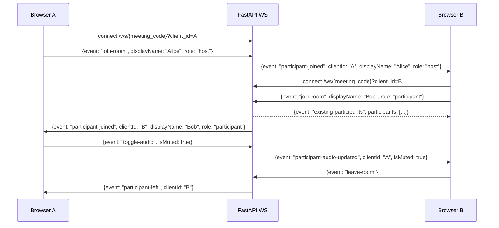

# Phase 5 — Full WebSocket Signaling Protocol

## Goal

Upgrade the backend WebSocket relay into a proper event-dispatch system that tracks participant state. Build a `useWebSocket` hook on the frontend and wire it into the meeting room so participant join/leave events update the UI in real time.

---

## Data Flow



---

## Backend Changes

### `apps/api/websocket/manager.py`

Extend the `ConnectionManager` to store participant metadata alongside each WebSocket:

```python
from dataclasses import dataclass, field

@dataclass
class ParticipantState:
    client_id: str
    display_name: str
    role: str          # "host" | "participant"
    is_muted: bool = False
    is_video_on: bool = True
    is_screen_sharing: bool = False

class ConnectionManager:
    def __init__(self) -> None:
        # meeting_code -> { client_id: (WebSocket, ParticipantState) }
        self.rooms: dict[str, dict[str, tuple[WebSocket, ParticipantState]]] = {}

    async def connect(self, meeting_code, client_id, websocket, participant: ParticipantState) -> None:
        await websocket.accept()
        self.rooms.setdefault(meeting_code, {})[client_id] = (websocket, participant)

    def get_participants(self, meeting_code: str) -> list[ParticipantState]:
        return [state for _, state in self.rooms.get(meeting_code, {}).values()]

    def disconnect(self, meeting_code, client_id) -> None: ...   # unchanged logic

    async def broadcast(self, meeting_code, message, exclude=None) -> None: ...
    async def send_to(self, meeting_code, client_id, message) -> None: ...
    async def update_participant(self, meeting_code, client_id, **kwargs) -> None:
        # Update fields on ParticipantState in-place
        entry = self.rooms.get(meeting_code, {}).get(client_id)
        if entry:
            state = entry[1]
            for k, v in kwargs.items():
                setattr(state, k, v)
```

### `apps/api/websocket/signaling.py`

Replace the simple broadcast relay with event dispatch:

```python
@router.websocket("/ws/{meeting_code}")
async def signaling_endpoint(websocket, meeting_code, client_id: str = Query(...)):
```

The `client_id` is now a query param sent by the client (a UUID generated in the browser). This makes it predictable and matchable on the frontend.

**Event handlers** (dispatch table pattern — `match event:`):

| Client → Server event  | Server action                                                                                                                 |
| ---------------------- | ----------------------------------------------------------------------------------------------------------------------------- |
| `join-room`            | Register participant state; send `existing-participants` back to joining client; broadcast `participant-joined` to all others |
| `leave-room`           | Break loop; cleanup handled in `finally`                                                                                      |
| `offer`                | Route to specific `targetClientId` via `send_to`                                                                              |
| `answer`               | Route to specific `targetClientId` via `send_to`                                                                              |
| `ice-candidate`        | Route to specific `targetClientId` via `send_to`                                                                              |
| `toggle-audio`         | Update `ParticipantState.is_muted`; broadcast `participant-audio-updated` to room                                             |
| `toggle-video`         | Update `ParticipantState.is_video_on`; broadcast `participant-video-updated` to room                                          |
| `screen-share-started` | Update `is_screen_sharing=True`; broadcast `screen-share-started`                                                             |
| `screen-share-stopped` | Update `is_screen_sharing=False`; broadcast `screen-share-stopped`                                                            |
| `mute-participant`     | Verify sender is host; send `host-muted-you` to target client (Phase 7)                                                       |
| `remove-participant`   | Verify sender is host; send `removed-from-meeting` to target (Phase 7)                                                        |
| `end-meeting`          | Verify sender is host; broadcast `meeting-ended` to all; call `PATCH /meetings/{code}` status=ended (Phase 7)                 |

**On disconnect (finally block)**:

```python
manager.disconnect(meeting_code, client_id)
await manager.broadcast(meeting_code, {
    "event": "participant-left",
    "clientId": client_id,
})
```

**`join-room` flow in detail**:

```python
case "join-room":
    participant = ParticipantState(
        client_id=client_id,
        display_name=data["displayName"],
        role=data.get("role", "participant"),
    )
    await manager.connect(meeting_code, client_id, websocket, participant)
    # Send existing room state back to newcomer
    existing = manager.get_participants(meeting_code)
    await manager.send_to(meeting_code, client_id, {
        "event": "existing-participants",
        "participants": [asdict(p) for p in existing if p.client_id != client_id],
    })
    # Notify everyone else
    await manager.broadcast(meeting_code, {
        "event": "participant-joined",
        "clientId": client_id,
        "displayName": participant.display_name,
        "role": participant.role,
    }, exclude=client_id)
```

Implementation note on connect vs join-room ordering: The WebSocket must be accepted (via `await websocket.accept()`) immediately at connection time before any `receive_json()` call. However, **the participant is not added to the room dict until the `join-room` message arrives**. Until then, the websocket is held in a local variable but not broadcast-able. This keeps the manager clean — only fully-identified participants appear in `rooms`.

---

## Frontend Changes

### `apps/web/hooks/useWebSocket.ts`

A robust WebSocket hook:

```typescript
"use client";

interface UseWebSocketOptions {
  meetingCode: string;
  clientId: string; // UUID generated once per session
  onEvent: (event: WSEvent) => void;
}

interface UseWebSocketReturn {
  send: (message: WSMessage) => void;
  isConnected: boolean;
}

export function useWebSocket({
  meetingCode,
  clientId,
  onEvent,
}: UseWebSocketOptions): UseWebSocketReturn;
```

Implementation details:

- Connect to `${WS_URL}/ws/${meetingCode}?client_id=${clientId}`
- Use `useRef` for the WebSocket instance (not state — avoids re-renders)
- On `onopen`: set `isConnected = true`
- On `onmessage`: parse JSON, call `onEvent(parsed)`
- On `onclose` / `onerror`: set `isConnected = false`; log but don't auto-reconnect for MVP
- `send()`: check `ws.readyState === WebSocket.OPEN` before sending; queue message if not open yet (simple array buffer)
- Cleanup: `ws.close()` in `useEffect` return

### Wire into `MeetingRoom.tsx`

```typescript
const clientId = useMemo(() => crypto.randomUUID(), []);

const { send, isConnected } = useWebSocket({
  meetingCode,
  clientId,
  onEvent: handleWsEvent,
});

// After media is ready and WS is connected:
useEffect(() => {
  if (isConnected) {
    send({
      event: "join-room",
      displayName,
      role: isHost ? "host" : "participant",
    });
  }
}, [isConnected]);

function handleWsEvent(event: WSEvent) {
  switch (event.event) {
    case "existing-participants":
      setRemoteParticipants(event.participants);
      break;
    case "participant-joined":
      setRemoteParticipants((prev) => [...prev, event]);
      break;
    case "participant-left":
      setRemoteParticipants((prev) =>
        prev.filter((p) => p.clientId !== event.clientId),
      );
      break;
    case "participant-audio-updated":
      setRemoteParticipants((prev) =>
        prev.map((p) =>
          p.clientId === event.clientId ? { ...p, is_muted: event.isMuted } : p,
        ),
      );
      break;
    case "participant-video-updated":
      setRemoteParticipants((prev) =>
        prev.map((p) =>
          p.clientId === event.clientId
            ? { ...p, is_video_on: event.isVideoOn }
            : p,
        ),
      );
      break;
    case "offer":
    case "answer":
    case "ice-candidate":
      // Passed to useWebRTC in Phase 6
      handleWebRTCSignal(event);
      break;
  }
}
```

Update `toggleAudio`/`toggleVideo` in `ControlBar` to also call:

```typescript
send({ event: "toggle-audio", isMuted: !isMuted });
send({ event: "toggle-video", isVideoOn: !isVideoOn });
```

---

## TypeScript types for WS events (`apps/web/lib/types.ts` additions)

```typescript
export type WSMessage =
  | { event: "join-room"; displayName: string; role: string }
  | { event: "leave-room" }
  | { event: "offer"; targetClientId: string; sdp: RTCSessionDescriptionInit }
  | { event: "answer"; targetClientId: string; sdp: RTCSessionDescriptionInit }
  | {
      event: "ice-candidate";
      targetClientId: string;
      candidate: RTCIceCandidateInit;
    }
  | { event: "toggle-audio"; isMuted: boolean }
  | { event: "toggle-video"; isVideoOn: boolean }
  | { event: "screen-share-started" }
  | { event: "screen-share-stopped" }
  | { event: "mute-participant"; targetClientId: string }
  | { event: "remove-participant"; targetClientId: string }
  | { event: "mute-all" } // Phase 7: host mutes all participants
  | { event: "end-meeting" };

export type WSEvent =
  | { event: "existing-participants"; participants: RemoteParticipant[] }
  | {
      event: "participant-joined";
      clientId: string;
      displayName: string;
      role: string;
    }
  | { event: "participant-left"; clientId: string }
  | { event: "participant-audio-updated"; clientId: string; isMuted: boolean }
  | { event: "participant-video-updated"; clientId: string; isVideoOn: boolean }
  | { event: "offer"; clientId: string; sdp: RTCSessionDescriptionInit }
  | { event: "answer"; clientId: string; sdp: RTCSessionDescriptionInit }
  | { event: "ice-candidate"; clientId: string; candidate: RTCIceCandidateInit }
  | { event: "screen-share-started"; clientId: string }
  | { event: "screen-share-stopped"; clientId: string }
  | { event: "host-muted-you" }
  | { event: "removed-from-meeting" }
  | { event: "meeting-ended" }
  | { event: "all-muted"; by: string }; // Phase 7: host muted all participants
```

---

## Out of Scope

**In-meeting chat** is listed in the architecture guide's WebSocket section but is **not required by the assignment brief** (not listed under Core Features or Bonus). It is intentionally omitted from all phases. It can be noted in Phase 8's README as a production improvement.

---

## Acceptance Criteria

- Open two browser tabs to the same meeting code; second tab shows "participant-joined" notification
- Toggling mic in Tab A updates the mute icon for Tab A's tile in Tab B
- Closing Tab A shows "participant-left" in Tab B within 1 second
- `existing-participants` event correctly populates the participant list for late joiners
- Connection status indicator (green dot) visible in `MeetingHeader` or `ParticipantsSidebar`
- No unhandled promise rejections in browser console during normal join/leave flows
