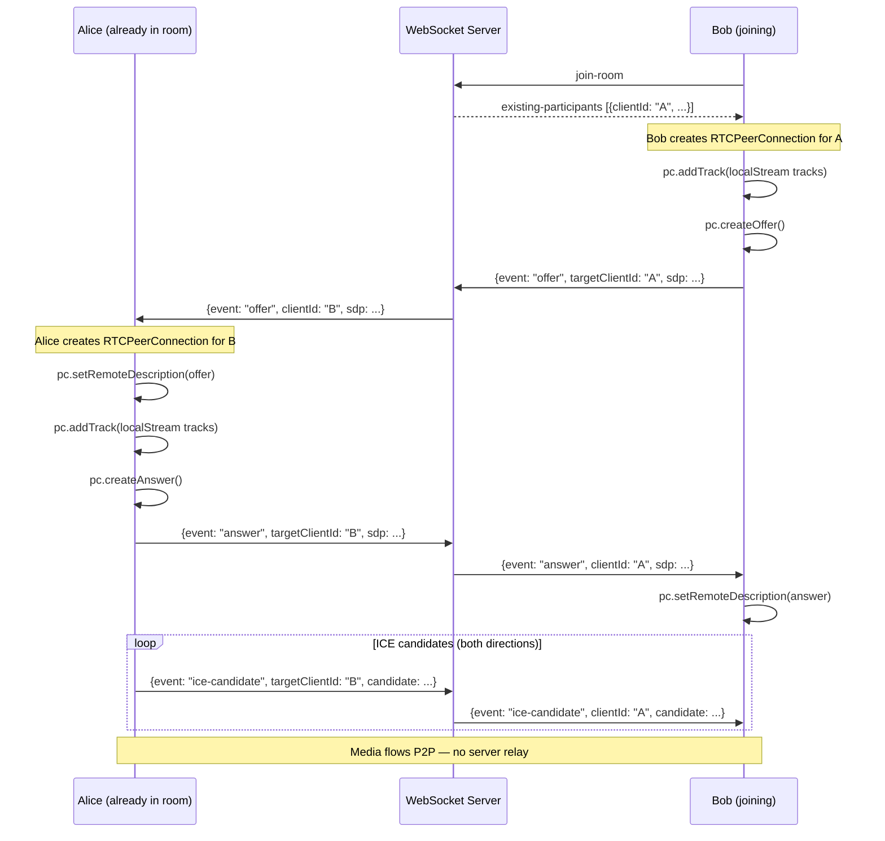

# Phase 6 — WebRTC Mesh: Peer Connections, Video Streams, Screen Sharing

## Goal

Wire up full peer-to-peer video and audio using RTCPeerConnection in a mesh topology. Every participant connects directly to every other participant. Add screen sharing via `getDisplayMedia`.

---

## Architecture: Mesh Topology

```
      Alice ←──────────────── Bob
        │                      │
        └──────── Carol ───────┘
```

For N participants: each has N-1 peer connections.
For 4 users: 3 connections per user = 6 total connections in the room.

This is acceptable for 2–5 participants (assignment scope).

---

## WebRTC Signaling Flow



---

## Files to Create

### `apps/web/hooks/useWebRTC.ts`

Core WebRTC hook. Manages one `RTCPeerConnection` per remote client.

```typescript
"use client";

interface UseWebRTCOptions {
  localStream: MediaStream | null;
  onRemoteStream: (clientId: string, stream: MediaStream) => void;
  onRemoteStreamRemoved: (clientId: string) => void;
  send: (message: WSMessage) => void; // from useWebSocket
}

interface UseWebRTCReturn {
  handleSignal: (event: WSEvent) => void; // called from handleWsEvent in MeetingRoom
  handleExistingParticipants: (clientIds: string[]) => void; // call on "existing-participants"
  handleParticipantLeft: (clientId: string) => void;
  startScreenShare: () => Promise<void>;
  stopScreenShare: () => void;
  isScreenSharing: boolean;
  /** Non-null while screen sharing — use this stream for the local VideoTile instead
   *  of localStream, so the local user also sees their own screen preview. */
  localPreviewStream: MediaStream | null;
}
```

Internal state:

```typescript
const peerConnections = useRef<Map<string, RTCPeerConnection>>(new Map());
// ICE candidates that arrive before setRemoteDescription is called are queued here.
// Flushed immediately after setRemoteDescription resolves.
const iceCandidateQueue = useRef<Map<string, RTCIceCandidateInit[]>>(new Map());
```

#### STUN server configuration

```typescript
const ICE_SERVERS: RTCConfiguration = {
  iceServers: [
    { urls: "stun:stun.l.google.com:19302" },
    { urls: "stun:stun1.l.google.com:19302" },
  ],
};
```

#### `createPeerConnection(remoteClientId: string): RTCPeerConnection`

```typescript
function createPeerConnection(remoteClientId: string): RTCPeerConnection {
  const pc = new RTCPeerConnection(ICE_SERVERS);

  // Add local tracks to the connection
  localStream?.getTracks().forEach((track) => pc.addTrack(track, localStream));

  // ICE candidate handler — relay via WebSocket
  pc.onicecandidate = ({ candidate }) => {
    if (candidate) {
      send({
        event: "ice-candidate",
        targetClientId: remoteClientId,
        candidate: candidate.toJSON(),
      });
    }
  };

  // Remote stream handler
  pc.ontrack = ({ streams }) => {
    if (streams[0]) {
      onRemoteStream(remoteClientId, streams[0]);
    }
  };

  // Connection state logging
  pc.onconnectionstatechange = () => {
    if (
      pc.connectionState === "failed" ||
      pc.connectionState === "disconnected"
    ) {
      // Clean up and notify
      handleParticipantLeft(remoteClientId);
    }
  };

  peerConnections.current.set(remoteClientId, pc);
  return pc;
}
```

#### Offer flow (Bob initiates after receiving `existing-participants`)

```typescript
async function initiateOffer(remoteClientId: string) {
  const pc = createPeerConnection(remoteClientId);
  const offer = await pc.createOffer();
  await pc.setLocalDescription(offer);
  send({ event: "offer", targetClientId: remoteClientId, sdp: offer });
}
```

#### Signal handlers

ICE candidates frequently arrive over WebSocket before `setRemoteDescription` has been called on the peer connection (because signaling and ICE trickle proceed in parallel). Calling `addIceCandidate` before `setRemoteDescription` throws an `InvalidStateError` and drops the candidate, causing the connection to stall or fail silently. The fix is to queue candidates and flush them immediately after the remote description is set.

```typescript
/** Queue an ICE candidate if the PC isn't ready yet, otherwise apply it immediately. */
async function applyOrQueueCandidate(
  remoteClientId: string,
  candidate: RTCIceCandidateInit,
) {
  const pc = peerConnections.current.get(remoteClientId);
  if (!pc || pc.remoteDescription === null) {
    // Remote description not set yet — buffer the candidate
    const queue = iceCandidateQueue.current.get(remoteClientId) ?? [];
    queue.push(candidate);
    iceCandidateQueue.current.set(remoteClientId, queue);
  } else {
    await pc.addIceCandidate(new RTCIceCandidate(candidate));
  }
}

/** Flush all queued ICE candidates after setRemoteDescription resolves. */
async function flushCandidateQueue(remoteClientId: string) {
  const pc = peerConnections.current.get(remoteClientId);
  const queued = iceCandidateQueue.current.get(remoteClientId) ?? [];
  for (const candidate of queued) {
    await pc?.addIceCandidate(new RTCIceCandidate(candidate));
  }
  iceCandidateQueue.current.delete(remoteClientId);
}

async function handleSignal(event: WSEvent) {
  switch (event.event) {
    case "offer": {
      const pc = createPeerConnection(event.clientId);
      await pc.setRemoteDescription(new RTCSessionDescription(event.sdp));
      // Flush any ICE candidates that arrived before the offer was processed
      await flushCandidateQueue(event.clientId);
      const answer = await pc.createAnswer();
      await pc.setLocalDescription(answer);
      send({ event: "answer", targetClientId: event.clientId, sdp: answer });
      break;
    }
    case "answer": {
      const pc = peerConnections.current.get(event.clientId);
      if (!pc) break;
      await pc.setRemoteDescription(new RTCSessionDescription(event.sdp));
      // Flush any ICE candidates that arrived before the answer was processed
      await flushCandidateQueue(event.clientId);
      break;
    }
    case "ice-candidate": {
      await applyOrQueueCandidate(event.clientId, event.candidate);
      break;
    }
  }
}
```

#### `handleExistingParticipants(clientIds: string[])`

Called when the current user receives `existing-participants`. For each existing participant, initiate an offer:

```typescript
// The joining client (Bob) initiates offers to all existing participants.
// Each offer uses createPeerConnection which registers the PC in peerConnections.current.
for (const clientId of clientIds) {
  await initiateOffer(clientId);
}
```

#### `handleParticipantLeft(clientId: string)`

```typescript
const pc = peerConnections.current.get(clientId);
pc?.close();
peerConnections.current.delete(clientId);
iceCandidateQueue.current.delete(clientId); // discard buffered candidates for gone peer
onRemoteStreamRemoved(clientId);
```

#### Screen sharing

The screen share track replaces the video track in all peer connections so remote participants see the screen. The local video tile also needs to show the screen stream — otherwise the local user still sees their own camera while peers see the screen. `useWebRTC` exposes a `localPreviewStream` value that `VideoGrid` uses for the local tile instead of the raw `localStream` from `useMediaDevices` when screen sharing is active.

```typescript
// Exposed in UseWebRTCReturn so MeetingRoom.tsx / VideoGrid can use it:
//   localPreviewStream: MediaStream | null  ← screen stream when sharing, else null
//   isScreenSharing: boolean

const [localPreviewStream, setLocalPreviewStream] =
  useState<MediaStream | null>(null);

async function startScreenShare() {
  const screenStream = await navigator.mediaDevices.getDisplayMedia({
    video: true,
  });
  const screenTrack = screenStream.getVideoTracks()[0];

  // Replace video track in all peer connections so remotes see the screen
  for (const pc of peerConnections.current.values()) {
    const sender = pc.getSenders().find((s) => s.track?.kind === "video");
    await sender?.replaceTrack(screenTrack);
  }

  // Expose the screen stream as the local preview so the local tile also shows the screen
  setLocalPreviewStream(screenStream);
  setIsScreenSharing(true);

  // When the user clicks the browser's native "Stop sharing" button
  screenTrack.onended = stopScreenShare;
  send({ event: "screen-share-started" });
}

function stopScreenShare() {
  const cameraTrack = localStream?.getVideoTracks()[0];
  for (const pc of peerConnections.current.values()) {
    const sender = pc.getSenders().find((s) => s.track?.kind === "video");
    cameraTrack && sender?.replaceTrack(cameraTrack);
  }
  // Revert local preview back to camera
  setLocalPreviewStream(null);
  setIsScreenSharing(false);
  send({ event: "screen-share-stopped" });
}
```

---

## Files to Edit

### `apps/web/app/meeting/[meetingCode]/MeetingRoom.tsx`

Add remote stream state and wire up `useWebRTC`:

```typescript
// Remote streams state
const [remoteStreams, setRemoteStreams] = useState<Map<string, MediaStream>>(
  new Map(),
);

const {
  handleSignal,
  handleExistingParticipants,
  startScreenShare,
  stopScreenShare,
  isScreenSharing,
} = useWebRTC({
  localStream,
  onRemoteStream: (clientId, stream) => {
    setRemoteStreams((prev) => new Map(prev).set(clientId, stream));
  },
  onRemoteStreamRemoved: (clientId) => {
    setRemoteStreams((prev) => {
      const next = new Map(prev);
      next.delete(clientId);
      return next;
    });
  },
  send,
});

// Update handleWsEvent to pass signals to WebRTC
function handleWsEvent(event: WSEvent) {
  switch (event.event) {
    case "existing-participants":
      setRemoteParticipants(event.participants);
      handleExistingParticipants(event.participants.map((p) => p.clientId));
      break;
    case "participant-joined":
      setRemoteParticipants((prev) => [...prev, event]);
      // Offer initiated by the joiner, not the existing participant
      break;
    case "participant-left":
      setRemoteParticipants((prev) =>
        prev.filter((p) => p.clientId !== event.clientId),
      );
      handleParticipantLeft(event.clientId); // exposed from useWebRTC
      break;
    case "offer":
    case "answer":
    case "ice-candidate":
      handleSignal(event);
      break;
    // ... other events
  }
}
```

### `apps/web/components/meeting/VideoGrid.tsx`

Update to render remote video tiles alongside local:

```typescript
// Props now include remoteStreams, remoteParticipants, and localPreviewStream
<VideoGrid
  localStream={localPreviewStream ?? localStream}  // screen stream takes priority for local tile
  localDisplayName={displayName}
  isMuted={isMuted}
  isVideoOn={isVideoOn}
  remoteParticipants={remoteParticipants}   // WSEvent participant-joined list
  remoteStreams={remoteStreams}              // Map<clientId, MediaStream>
/>
```

Render one `VideoTile` for local + one per remote client (even if stream is not yet received — show loading state).

### `apps/web/components/meeting/ControlBar.tsx`

Wire screen share button:

```typescript
onClick={isScreenSharing ? stopScreenShare : startScreenShare}
// Change icon to MonitorX when sharing
```

---

## Edge Cases to Handle

| Scenario                                                    | Handling                                                                |
| ----------------------------------------------------------- | ----------------------------------------------------------------------- |
| ICE candidate arrives before remote description is set      | Queue candidates, add after `setRemoteDescription` resolves             |
| `localStream` is null when offer arrives (camera not ready) | Defer `addTrack` until stream is available; use a `pendingOffers` queue |
| Participant rejoins with the same client ID                 | Close old PC, create new one                                            |
| Screen share stopped via browser button                     | `screenTrack.onended` fires `stopScreenShare`                           |
| `RTCPeerConnection` fails (`connectionState === 'failed'`)  | Log warning; call `handleParticipantLeft` to clean up UI                |

---

## Acceptance Criteria

- Two browser tabs on the same meeting see each other's video
- Audio works bidirectionally
- Toggling camera in one tab shows/hides video in the other
- Third tab joining sees both existing participants' video
- A tab closing removes its video tile from all other tabs within 2 seconds
- Screen share button in one tab shows screen content in other tabs
- Stopping screen share reverts back to camera in all tabs
- ICE connection state reaches "connected" or "completed" (visible in browser DevTools → WebRTC internals: `chrome://webrtc-internals`)
